# 苍翼混沌效应构建器 - 项目架构分析

## 1. 项目概览与技术栈

### 1.1 项目概述

本项目是一个为游戏《苍翼：混沌效应》(BlazBlue: Entropy Effect) 开发的网页工具，主要功能包括：
- **双重词条筛选页**：根据属性/流派/触发位筛选符合条件的双重策略（共73种）
- **流派构建页**：为5个技能位配置流派，自动计算可激活的双重策略

### 1.2 技术栈清单

| 类别 | 技术 | 版本 | 用途 |
|------|------|------|------|
| 框架 | Vue | ^3.4.21 | 前端框架，使用 Composition API |
| 构建工具 | Vite | ^5.2.8 | 开发服务器与生产构建 |
| 状态管理 | Pinia | ^2.1.7 | 全局状态管理 |
| UI组件库 | Element Plus | ^2.6.3 | 基础UI组件 |
| 路由 | Vue Router | ^4.3.0 | 单页应用路由，使用 Hash 模式 |
| 样式 | SCSS | ^1.74.1 | CSS预处理器 |
| 语言 | TypeScript | ^5.2.2 | 类型安全的JavaScript超集 |

**浏览器兼容性**：现代浏览器（Chrome, Firefox, Safari, Edge）

### 1.3 构建配置

```typescript
// vite.config.ts
export default defineConfig({
  base: './',  // 相对路径，支持任意目录部署
  plugins: [vue()],
});
```

```json
// tsconfig.json 关键配置
{
  "compilerOptions": {
    "target": "ES2020",
    "module": "ESNext",
    "moduleResolution": "bundler",
    "strict": true,
    "noUnusedLocals": true,
    "noUnusedParameters": true
  }
}
```

---

## 2. 目录结构与模块职责

### 2.1 整体目录结构

```
src/
├── components/           # 表现层 - Vue组件
│   ├── Public/          # 公共组件
│   ├── SearchDoublePage/# 筛选页专用组件
│   └── SectBuilderPage/ # 构建页专用组件
├── composables/         # 组合式函数
├── config/              # 配置目录（向后兼容）
├── core/                # 核心层
│   └── data/            # 数据加载与冻结
├── domains/             # 领域层（DDD架构）
│   ├── builder/         # 构建领域
│   ├── config/          # 配置领域
│   ├── filter/          # 筛选领域
│   └── skill/           # 技能领域
├── interfaces/          # TypeScript类型定义
├── router/              # 路由配置
├── shared/              # 共享工具
│   └── validation/      # 验证逻辑
├── views/               # 页面视图
├── data/                # 静态数据文件
├── App.vue              # 根组件
└── main.ts              # 应用入口
```

### 2.2 模块职责说明

| 模块 | 职责 | 设计原则 |
|------|------|----------|
| `core/data` | 数据加载基础设施 | 单一职责，只负责加载和冻结 |
| `domains/skill` | 技能数据仓库 | Repository模式，管理数据访问 |
| `domains/config` | 配置常量与工具 | 常量集中管理，提供查询工具 |
| `domains/filter` | 筛选状态与逻辑 | Store+Service分离 |
| `domains/builder` | 构建状态与逻辑 | Store+Service分离 |
| `shared/validation` | 纯函数验证逻辑 | 与UI解耦，可独立测试 |
| `composables` | 可复用逻辑 | 全局单例模式 |

---

## 3. 核心架构模式

### 3.1 领域驱动设计（DDD）分层架构

项目采用领域驱动设计架构，将业务逻辑按领域划分：

```
┌─────────────────────────────────────────────────────────────┐
│                      表现层 (Presentation)                   │
│  ┌─────────────┐  ┌─────────────┐  ┌─────────────────────┐  │
│  │   Views     │  │ Components  │  │     Composables     │  │
│  │   (页面)     │  │   (组件)     │  │    (可复用逻辑)      │  │
│  └─────────────┘  └─────────────┘  └─────────────────────┘  │
├─────────────────────────────────────────────────────────────┤
│                       领域层 (Domain)                        │
│  ┌───────────┐ ┌───────────┐ ┌───────────┐ ┌─────────────┐ │
│  │  builder  │ │  filter   │ │   skill   │ │   config    │ │
│  │  构建领域  │ │  筛选领域  │ │  技能领域  │ │  配置领域   │ │
│  │  store.ts │ │  store.ts │ │repository │ │ constants.ts│ │
│  │ service.ts│ │ service.ts│ │  types.ts │ │  utils.ts   │ │
│  └───────────┘ └───────────┘ └───────────┘ └─────────────┘ │
├─────────────────────────────────────────────────────────────┤
│                        核心层 (Core)                         │
│                    ┌─────────────────┐                      │
│                    │   core/data     │                      │
│                    │  loader.ts      │  数据加载与冻结       │
│                    │  types.ts       │                      │
│                    └─────────────────┘                      │
├─────────────────────────────────────────────────────────────┤
│                      基础设施 (Infrastructure)                │
│  ┌─────────────────┐  ┌─────────────────┐                    │
│  │   interfaces    │  │ shared/validation│                   │
│  │   (类型定义)     │  │   (验证逻辑)      │                   │
│  └─────────────────┘  └─────────────────┘                    │
└─────────────────────────────────────────────────────────────┘
```

### 3.2 架构模式详解

#### 3.2.1 Repository 模式（数据访问层）

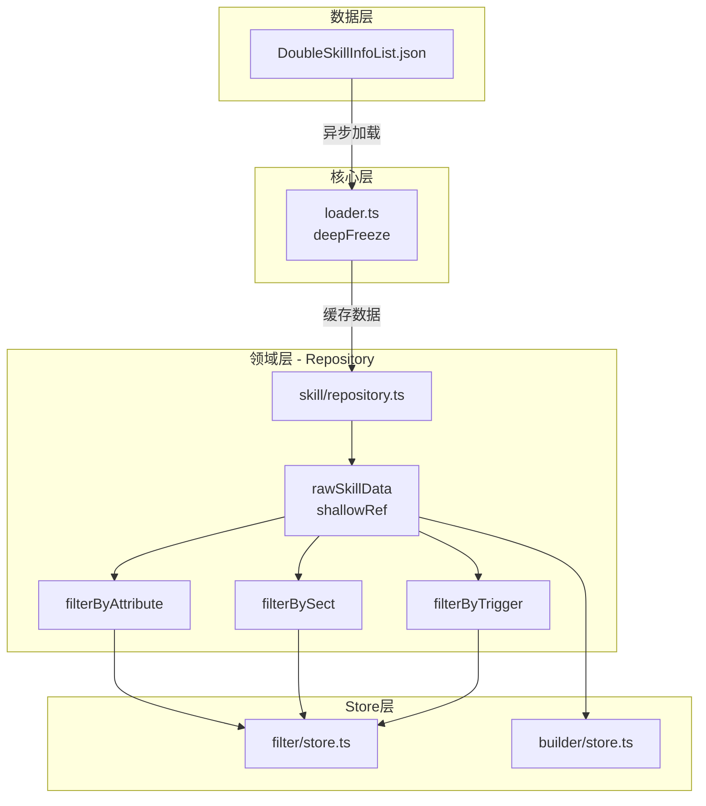

#### 3.2.2 Store + Service 分离模式

每个领域模块采用 Store 与 Service 分离的设计：

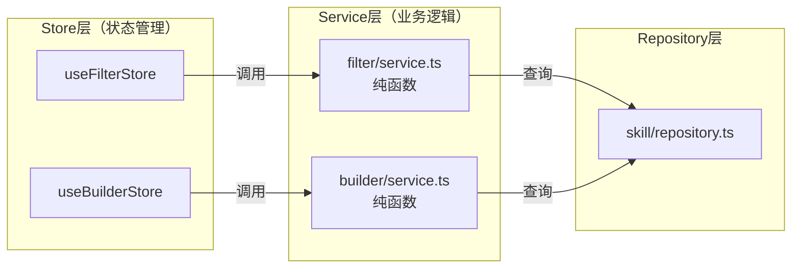

**设计优势**：
- Store 只负责状态管理，Service 只负责业务逻辑
- Service 层为纯函数，易于单元测试
- 逻辑与框架解耦，便于维护和迁移

---

## 4. 组件关系与调用链路

### 4.1 整体组件关系图

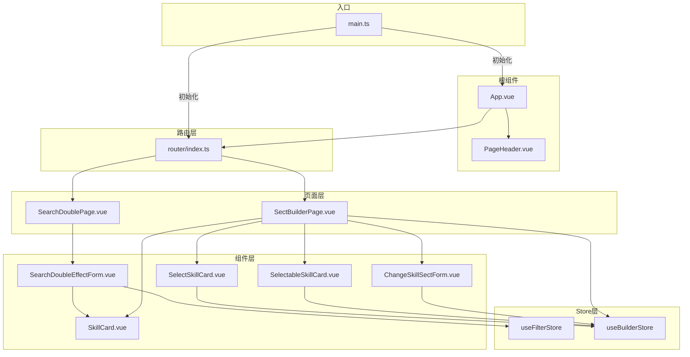

### 4.2 筛选页调用链路

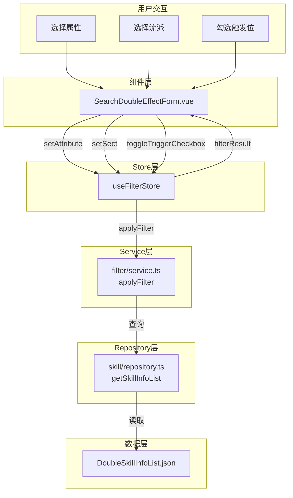

### 4.3 构建页调用链路

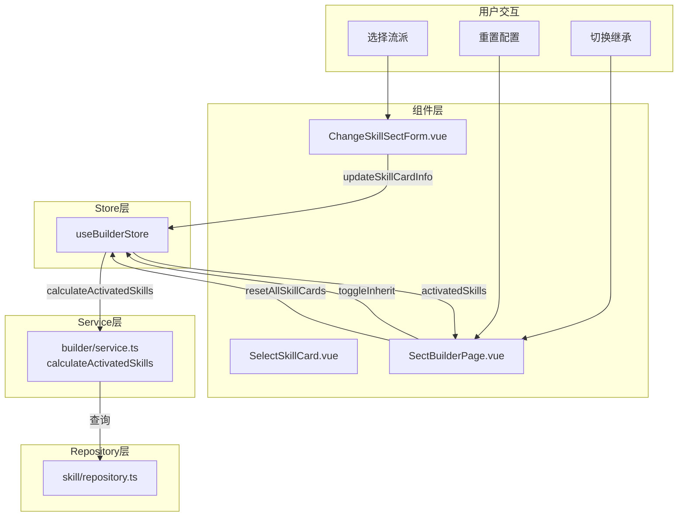

---

## 5. 数据流与状态管理

### 5.1 数据流架构

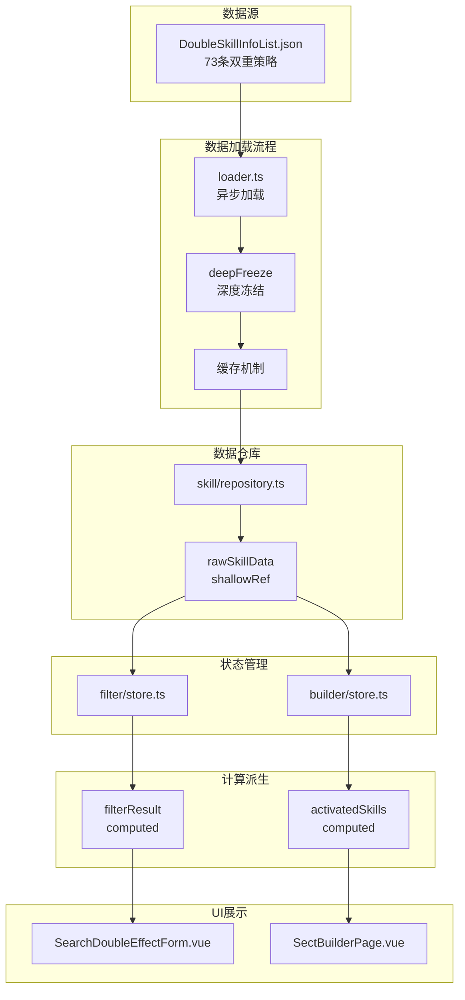

### 5.2 状态管理详解

#### 5.2.1 Filter Store 状态流

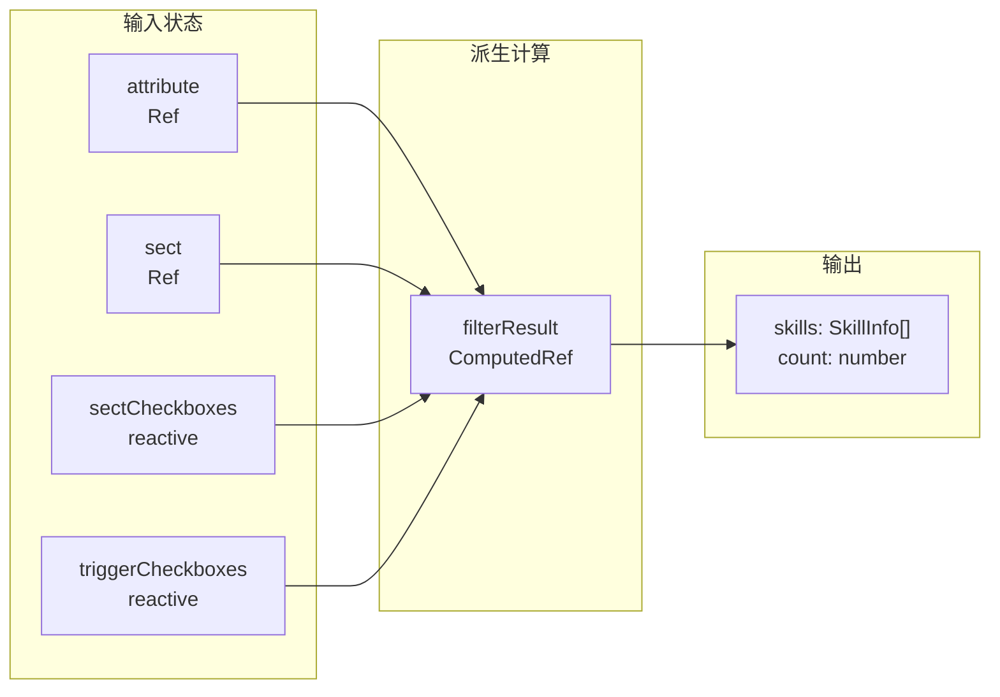

#### 5.2.2 Builder Store 状态流

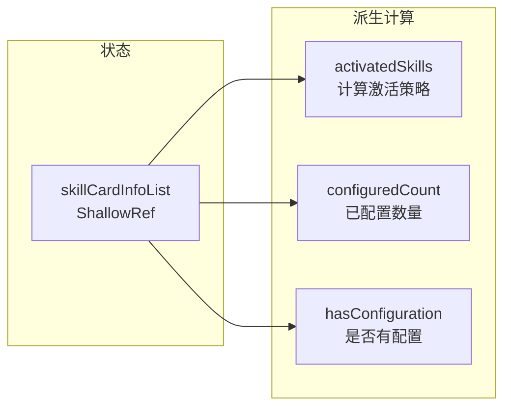

### 5.3 性能优化策略

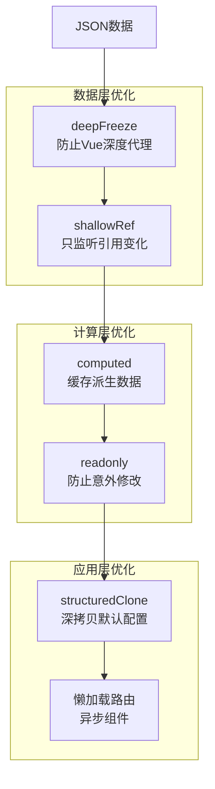

---

## 6. 配置管理与环境变量

### 6.1 应用配置

| 配置项 | 位置 | 说明 |
|--------|------|------|
| 主题偏好 | localStorage `theme-preference` | 用户主题选择（light/dark） |
| 构建基础路径 | vite.config.ts `base: './'` | 支持任意目录部署 |

### 6.2 游戏数据配置

```typescript
// domains/config/constants.ts
// 36种流派定义
export const sectList: SectInfo[] = [...];

// 7种属性
export const attributeList = ['火', '冰', '电', '毒', '暗', '光', '刃'];

// 5个技能位
export const triggerList = ['普攻', '技能', '冲刺', '传承', '召唤'];
```

### 6.3 CSS变量系统

采用 **shadcn/ui** 风格 HSL 格式 CSS 变量：

```scss
:root {
  // 基础颜色
  --background: hsl(0 0% 100%);
  --foreground: hsl(222.2 84% 4.9%);
  --primary: hsl(222.2 47.4% 11.2%);
  --border: hsl(214.3 31.8% 91.4%);
  --radius: 0.5rem;
  
  // 元素颜色
  --element-fire: hsl(0 84% 60%);
  --element-ice: hsl(199 89% 48%);
  // ... 其他元素颜色
}

.dark {
  // 深色模式变量
}
```

---

## 7. 构建、测试与部署流程

### 7.1 可用脚本

```bash
# 开发环境
pnpm dev              # 启动 Vite 开发服务器

# 构建
pnpm build            # 类型检查 + Vite 构建
# 等价于: vue-tsc && vite build

# 预览
pnpm preview          # 预览生产构建
```

### 7.2 构建流程

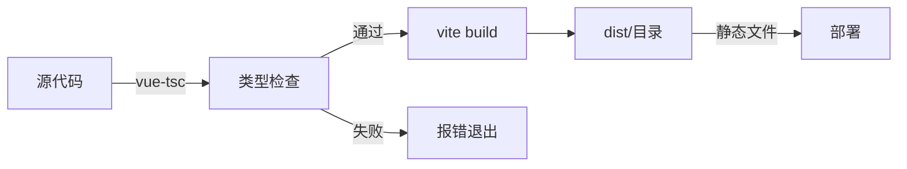

### 7.3 部署特性

- **Hash 模式路由**：`createWebHashHistory()`，无需服务器配置
- **相对路径**：`base: './'`，支持任意目录部署
- **静态部署**：构建产物为纯静态文件，可部署到任何静态托管服务

---

## 8. 可维护性建议与重构切入点

### 8.1 当前架构优势

1. **清晰的层次划分**：DDD 分层架构，职责明确
2. **性能优化到位**：deepFreeze + shallowRef + computed 组合
3. **类型安全**：TypeScript 严格模式，完整的类型定义
4. **可测试性**：Service 层为纯函数，易于单元测试
5. **主题系统完善**：支持深色/浅色模式切换

### 8.2 潜在改进点

#### 8.2.1 待办功能实现

| 优先级 | 功能 | 说明 |
|--------|------|------|
| 中 | 本地存储持久化 | 保存流派配置到 localStorage |
| 低 | 技能位选择器增强 | 筛选页支持多触发位精确筛选 |

#### 8.2.2 代码质量改进

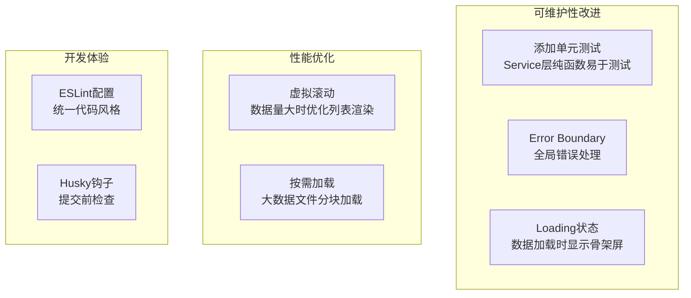

### 8.3 扩展性考虑

#### 8.3.1 添加新双重策略

1. 在 `src/data/DoubleSkillInfoList.json` 添加数据
2. 如涉及新流派，更新 `domains/config/constants.ts` 中的 `sectList`
3. 数据自动通过 Repository 模式加载，无需修改业务逻辑

#### 8.3.2 添加新页面

1. 在 `views/` 创建页面组件
2. 在 `router/index.ts` 添加路由
3. 如需新领域逻辑，在 `domains/` 创建新领域模块

---

## 9. 关键类型定义

### 9.1 核心数据类型

```typescript
// core/data/types.ts
interface SkillInfo {
  name: DoubleSkillName;           // 策略名称
  mainSect: SectValue;             // 主流派
  mainAttribute: Attribute;        // 主属性
  secondSect: SectValue;           // 副流派
  secondAttribute: Attribute;      // 副属性
  trigger: Trigger[];              // 触发位数组
  description: string;             // 效果描述
}

type FrozenSkillInfoList = readonly SkillInfo[];
```

### 9.2 构建领域类型

```typescript
// domains/builder/types.ts
interface SkillCardInfo {
  triggerName: Trigger;    // 触发位名称
  sect: SectValue | '';    // 流派名称（空表示未配置）
  inherit: boolean;        // 是否继承上位效果
}

type SkillCardInfoTuple = [
  SkillCardInfo,  // 普攻
  SkillCardInfo,  // 技能
  SkillCardInfo,  // 冲刺
  SkillCardInfo,  // 传承
  SkillCardInfo,  // 召唤
];

interface ActivatedSkillResult {
  skills: SkillInfo[];     // 已激活的策略列表
  count: number;           // 激活数量
}
```

### 9.3 筛选领域类型

```typescript
// domains/filter/types.ts
interface FilterState {
  attribute: Attribute | '';
  sect: SectValue | '';
  sectCheckboxes: SectCheckboxState;
  triggerCheckboxes: TriggerCheckboxState;
}

interface FilterResult {
  skills: SkillInfo[];
  count: number;
}
```

---

## 10. 附录：文件依赖图

### 10.1 核心模块依赖关系

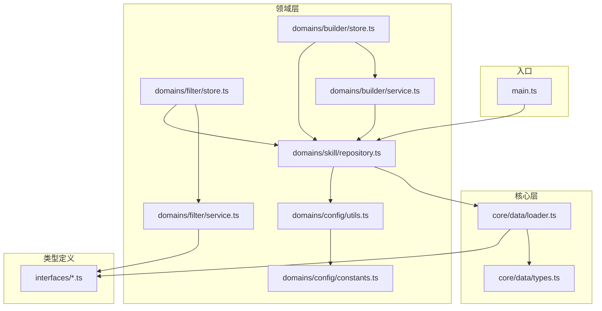

---

*文档生成时间: 2026-03-05*
*基于代码版本: Git HEAD 31a3171*